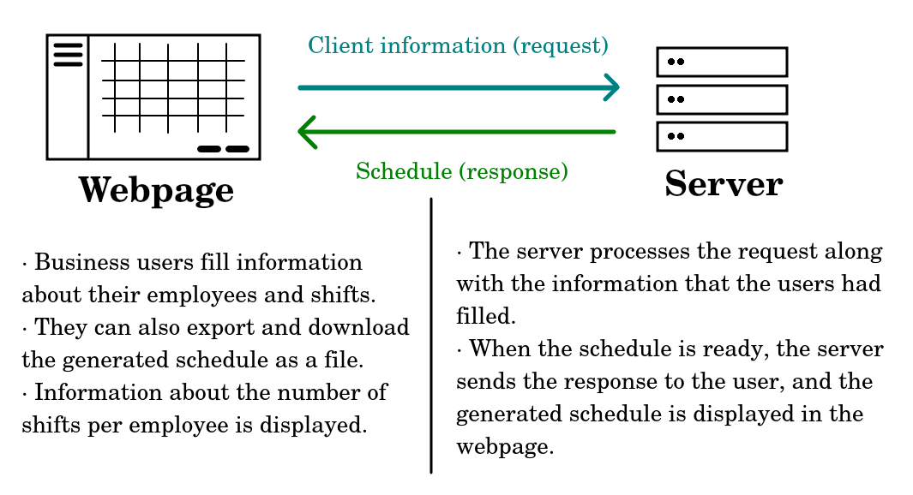

# Shiftiatrics: Automated Shift Scheduling for Businesses in the ER Industry
<u>Problem statement:</u> Businesses spend a lot of time, energy, and money in scheduling shifts & designing agreed-upon rosters every month, especially in the healthcare industry. In addition, shift schedules for emergency doctors are more complicated than, for example, dentists. Hence, there is a higher demand for automating shift schedules for emergency doctors than dentists.

<u>Solution:</u> I have built an automated scheduling website for businesses that coordinate ER staff members to use for automating this tedious task.

## Problem Analysis
Here are the challenges to keep track of:
- Businesses differ in scheduling shifts; for example, some designate employees for day and evening shifts without night ones. Others, such as emergency doctors, have day, evening, and night shifts as well.
- In addition, there is a variable number of ER staff members to keep track of when designing the monthly schedule; that number may change per month.
- ER staff members can swap with other ones, thus modifying the schedule.

With all of that information, I can design an effective system for automating schedules (auto-scheduling engine) for ER staff members.

## System Architecture & Plan
### File System
- `src` (Source code):
    - `client`: Code for the website.
    - `server`: Code for the auto-scheduling engine, back-end server, and utilities.
    - `db`: Data and schema for the database.
- `tests` (Automated tests for the whole app)

### Client-Server Connection

### Tech Stack
- Frontend:
    - **Next.js & TypeScript** for website programming.
    - **SASS** for website styling.
- Backend:
    - **Java** for running the auto-scheduling engine while prioritizing performance and memory safety.
    - **Python** for running the back-end server, and for writing utilities as Python has a large number of useful libraries.
- Database:
    - **PostgreSQL** for running SQL queries and the database server.